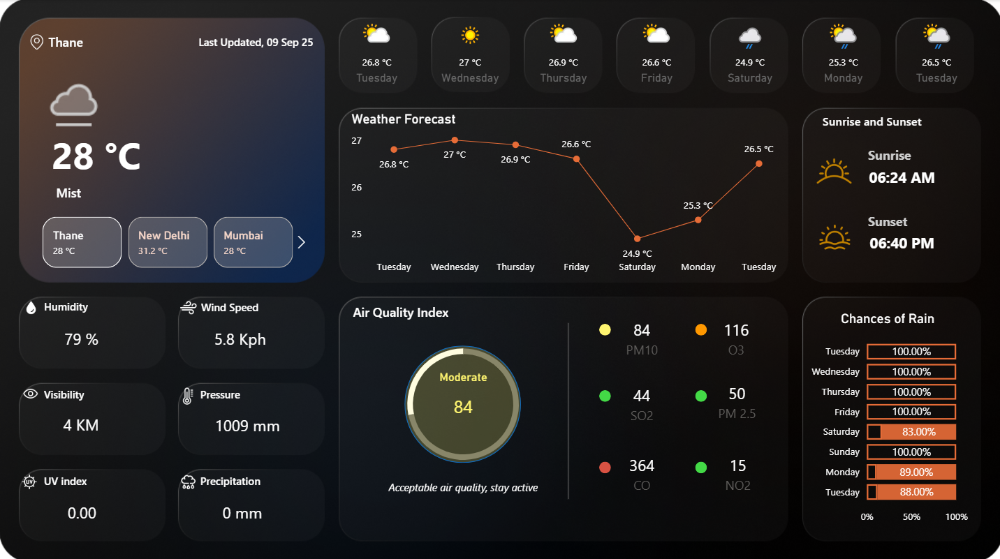

# 🌦️ Live Weather Insights with Power BI and API Integration

---

| | |
|---|---|
|  |  |
|  |  |

---

## Why WeatherAPI?
[WeatherAPI.com](https://www.weatherapi.com/) is a simple yet powerful service that provides live, historical, and forecast weather data. It is a perfect fit for Power BI because the data is available in JSON format, making it very easy to connect, process, transform, and visualize. With its detailed information on current weather, air quality, and forecasts, it enables building a professional, dynamic, and live weather dashboard.

## 🛠️Prerequisites
To get started with this project, you will need:  
- A free or paid account on [WeatherAPI.com](https://www.weatherapi.com/)  
- **Power BI Desktop** installed on your computer  
- Basic knowledge of Power BI, including how to load data, transform it, and create visuals  

## 🎯Project Workflow

### Step 1: Sign Up and Get API Key
First, create an account at WeatherAPI.com. Once registered, you will be given a personal **API key**. This key is essential because it authenticates your requests to the API. Without this key, Power BI won’t be able to fetch weather data.

### Step 2: Access Current Weather Data
WeatherAPI provides multiple endpoints, but for this project, we use the **Current Weather Data API**. The endpoint looks like this:
https://api.weatherapi.com/v1/current.json?key=YOUR_API_KEY&q=CITY_NAME

Replace `YOUR_API_KEY` with the actual key you got from WeatherAPI, and replace `CITY_NAME` with the city you want to fetch data for (e.g., Mumbai, Delhi, London, or New York).

### Step 3: Connect Power BI to WeatherAPI
Open **Power BI Desktop**. Go to **Get Data → Web** and paste the WeatherAPI URL you created in Step 2. Click **OK** and Power BI will start fetching the JSON data directly from the API.

### Step 4: Transform the Data
Once the data loads, Power BI will open it in the **Power Query Editor**. From here:  
- Expand the **current record** to reveal its fields.  
- Expand sub-records such as **condition** (weather description) or **air_quality** (pollution data).  
- Rename the columns into clean and readable names like `Temperature (°C)`, `Humidity (%)`, `Wind Speed (kph)`.  
- Once cleaned, click **Close & Apply** to load the transformed dataset into your Power BI model.

### Step 5: Add Visuals
Now it’s time to build the dashboard. You can add a variety of visuals to make the report interactive and insightful:  
- **Cards** to show the main KPIs such as temperature, humidity, or “feels like” temperature.  
- **Gauges** to represent wind speed or pressure values.  
- **Line or Bar Charts** to visualize daily variations in temperature or humidity.  
- **Filters or Slicers** to allow users to select different cities and compare their weather conditions.  

### Step 6: Styling & Interactivity
- Make the dashboard visually appealing and user-friendly.  
- Use a **Map Visual** to plot weather conditions by location.  
- Provide users with the ability to **dynamically switch cities** using slicers or dropdowns.  

### Step 7: Adding AQI Indicators
WeatherAPI also provides Air Quality Index (AQI) information in the JSON response under `current.air_quality`. You can:  
- Extract AQI values from the dataset.  
- Create **reusable DAX measures** to calculate AQI-related KPIs.  
- Add visuals like bar charts, gauges, or colored indicators to represent air quality levels.  
This adds more depth to your dashboard and helps analyze both weather and pollution data together.

## 📊Conclusion
By integrating **WeatherAPI** with **Power BI**, you can create a **dynamic and live Weather Insights Dashboard** that displays updated weather information, air quality data, and interactive visuals. While the data refresh happens when you reload or schedule refreshes in Power BI Service, the dashboard still provides **live API-driven insights** that can be enriched with AQI and other measures.  

With clean data transformation, reusable DAX measures, and interactive visuals, your dashboard will stay scalable, maintainable, and easy to enhance as requirements grow.  

With just a few simple steps, raw JSON weather data can be transformed into a professional, visually rich, and interactive dashboard in Power BI.  

**Happy Dashboarding!**
